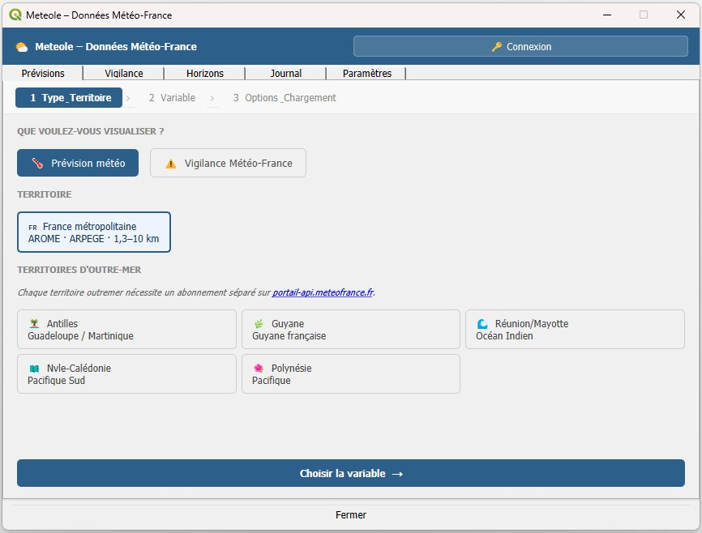

# Meteole QGIS Plugin

Plugin QGIS pour accéder aux données météorologiques **Météo-France** directement dans QGIS, via la librairie Python [meteole](https://github.com/MAIF/meteole).



## Fonctionnalités

- 🌡 **Prévisions AROME métropole** (1,3 km) — AROME, AROME-PI, AROME-PE, ARPEGE, PIAF
- 🏝 **Prévisions AROME Outre-Mer** (2,5 km) — Antilles, Guyane, Réunion/Mayotte, Nouvelle-Calédonie, Polynésie
- ⚠️ **Vigilance Météo-France** — carte officielle par département
- ⏱ **Navigateur temporel** — slider multi-horizons
- 🗺 Couches **raster GeoTIFF** et **points GeoPackage**

## Prérequis

- QGIS ≥ 3.16
- Python ≥ 3.9
- Librairie Python `meteole` ≥ 0.2.6 :
  ```
  pip install meteole
  ```
- `cfgrib` et `eccodes` pour les données AROME Outre-Mer :
  ```
  pip install cfgrib
  ```
- Un compte sur le [portail API Météo-France](https://portail-api.meteofrance.fr/) avec les abonnements nécessaires

## Installation

1. Télécharger le ZIP depuis [Releases](https://github.com/Aleas-territoire/meteole_qgis_plugin/releases)
2. Dans QGIS : **Extensions → Installer depuis un ZIP**
3. Sélectionner le fichier ZIP téléchargé

## Abonnements API requis

| Territoire | API Météo-France |
|---|---|
| France métropolitaine | `arome`, `arpege`, `piaf` |
| Antilles + Guyane | `arome-antilles-guyane` |
| Réunion / Mayotte | `arome-ocean-indien` |
| Nouvelle-Calédonie | `arome-nouvelle-caledonie` |
| Polynésie | `arome-polynesie` |

Tous les territoires outre-mer sont accessibles via **le package AROME outre-mer** sur le portail MF.

## Utilisation

### 1. Configurer la connexion
Aller dans l'onglet **Paramètres** et saisir votre token ou clé API Météo-France.

### 2. Choisir le territoire
Dans l'onglet **Prévisions**, cliquer sur la carte du territoire souhaité puis sur **"Choisir la variable →"**.

### 3. Sélectionner la variable
- **Métropole** : choisir le modèle (AROME, ARPEGE…) puis l'indicateur dans la liste
- **Outre-Mer** : sélectionner la variable dans la liste (ex. "Température 2m (K) [SP1]")

### 4. Configurer et charger
Définir l'horizon de prévision (ex. `001H` pour H+1, `001H,006H,024H` pour plusieurs horizons), puis cliquer **"⬇ Charger la couche"**.

## Structure des paquets AROME-OM

| Paquet | Contenu |
|---|---|
| SP1 | Vent, température, humidité, précipitations (surface) |
| SP2 | Température max/min, humidité spécifique, CAPE, nébulosité |
| SP3 | Flux de chaleur, rayonnement, contraintes turbulentes |
| IP1–IP4 | Variables isobares (géopotentiel, T, vent) à différents niveaux de pression |
| HP1–HP3 | Variables sur niveaux hybrides |
| IP5 | Nébulosité par étage |

## Licence

MIT — voir [LICENSE](LICENSE)

## Contribution

Voir [CONTRIBUTING.md](CONTRIBUTING.md)
