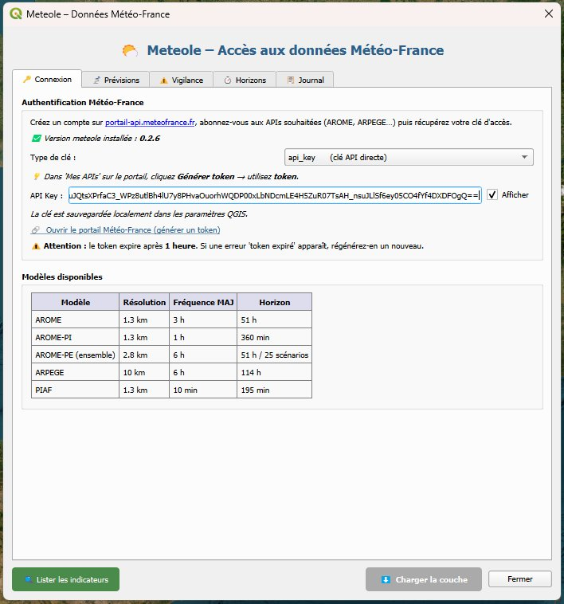
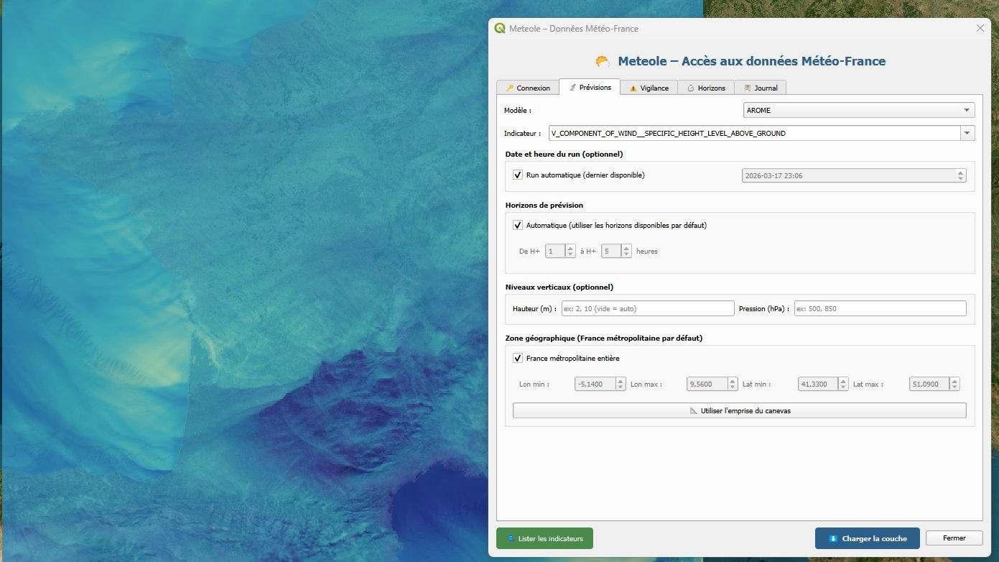
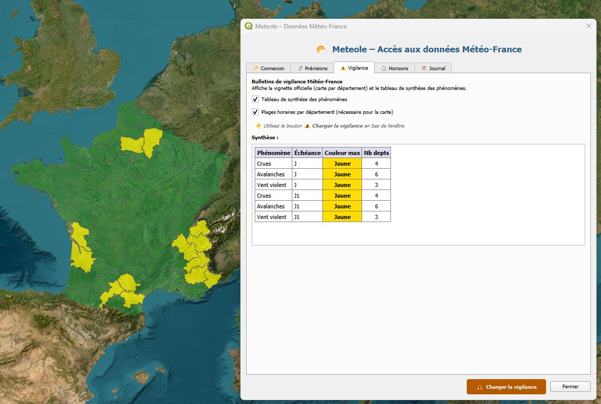
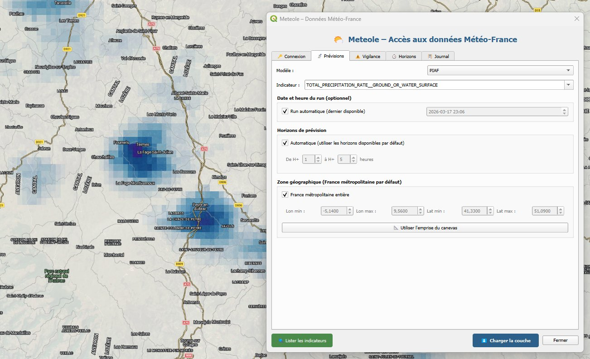

[README.md](https://github.com/user-attachments/files/26102280/README.md)
# Meteole — Plugin QGIS

> Accès direct aux données météorologiques **Météo-France** (AROME, ARPEGE, PIAF, Vigilance) dans QGIS, via la librairie Python [meteole](https://github.com/MAIF/meteole).


---

## Aperçu

| Connexion & authentification | Onglet Prévisions |
|---|---|
|  |  |

| Vigilance par département | Raster PIAF — précipitations |
|---|---|
|  |  |

---

## Présentation

Ce plugin permet de **télécharger et visualiser** les prévisions météorologiques haute résolution de Météo-France directement dans QGIS, sans manipulation manuelle de fichiers GRIB. Les données sont automatiquement converties en couches raster GeoTIFF et vecteur GeoPackage, géoréférencées et stylisées selon le type d'indicateur.

Il s'appuie sur la librairie open source **meteole**, développée par la MAIF, qui encapsule l'API WCS de Météo-France.

### Pourquoi ce plugin ?

Les modèles AROME (1,3 km de résolution) et ARPEGE fournissent la meilleure précision spatiale disponible pour la France métropolitaine — un ordre de grandeur supérieur aux APIs météo génériques (OpenWeather, etc.). Une fois chargées dans QGIS, ces données peuvent être **croisées avec n'importe quelle couche géographique** métier : portefeuilles de contrats, bâtiments, réseaux, parcelles agricoles, etc.

---

## Fonctionnalités

- **Prévisions numériques** : accès aux modèles AROME, AROME-PI, AROME-PE (ensemble), ARPEGE et PIAF
- **Import automatique** en couches raster (GeoTIFF) et points (GeoPackage) dans QGIS
- **Palettes de couleurs intelligentes** adaptées à chaque type d'indicateur (température, vent, précipitations, pression, humidité, nébulosité…)
- **Unités affichées** dans le nom des couches et la légende (K, m/s, kg/m², Pa, %…)
- **Navigateur d'horizons temporels** : slider pour basculer entre les couches de prévision H+1, H+2…
- **Bulletins de vigilance** Météo-France : carte par département colorée selon le niveau d'alerte
- **Zone géographique flexible** : France entière, emprise du canevas, ou bbox personnalisée
- **Interface contextuelle** : les options s'adaptent au modèle sélectionné (niveaux verticaux masqués pour PIAF, etc.)
- **Gestion d'erreurs claire** : messages explicites pour les erreurs d'authentification, token expiré, abonnement manquant

---

## Modèles disponibles

| Modèle | Résolution | Fréquence de mise à jour | Horizon |
|---|---|---|---|
| AROME | 1,3 km | 3 h | 51 h |
| AROME-PI (Prévision Immédiate) | 1,3 km | 1 h | 6 h |
| AROME-PE (ensemble) | 2,8 km | 6 h | 51 h / 25 scénarios |
| ARPEGE | 10 km | 6 h | 114 h |
| PIAF | 1,3 km | 10 min | 3 h (précipitations uniquement) |

---

## Prérequis

- **QGIS** ≥ 3.16
- **Python** ≥ 3.9 (inclus dans QGIS)
- **Un compte Météo-France** sur [portail-api.meteofrance.fr](https://portail-api.meteofrance.fr) avec abonnement aux APIs souhaitées
- La librairie Python **meteole** (installée automatiquement au premier lancement si absente)

---

## Installation

### Via le gestionnaire de plugins QGIS (recommandé)

1. Dans QGIS : **Extensions → Installer/Gérer les extensions**
2. Rechercher `Meteole`
3. Cliquer **Installer**

### Via ZIP (installation manuelle)

1. Télécharger le fichier `meteole_qgis_vX.X.zip` depuis la page [Releases](../../releases)
2. Dans QGIS : **Extensions → Installer/Gérer les extensions → Installer depuis un ZIP**
3. Sélectionner le fichier téléchargé

### Depuis les sources

```bash
git clone https://github.com/MAIF/meteole-qgis.git
```

Copier le dossier `meteole_qgis/` dans votre répertoire de plugins QGIS :

- **Windows** : `%APPDATA%\QGIS\QGIS3\profiles\default\python\plugins\`
- **Linux** : `~/.local/share/QGIS/QGIS3/profiles/default/python/plugins/`
- **macOS** : `~/Library/Application Support/QGIS/QGIS3/profiles/default/python/plugins/`

---

## Configuration

### Obtenir un token Météo-France

1. Créer un compte sur [portail-api.meteofrance.fr](https://portail-api.meteofrance.fr)
2. S'abonner aux APIs souhaitées (AROME, ARPEGE, Vigilance…)
3. Dans **Mes APIs**, cliquer **Générer token**
4. Copier le token dans l'onglet **Connexion** du plugin

> ⚠️ Le token expire après **1 heure**. Si une erreur d'authentification apparaît, régénérer un nouveau token sur le portail.

### Types d'authentification supportés

| Type | Description |
|---|---|
| `token` | Token généré sur le portail (recommandé) |
| `api_key` | Clé API directe |
| `application_id` | OAuth Application ID |

---

## Utilisation

### Charger des données de prévision

1. Onglet **Connexion** : saisir le token
2. Onglet **Prévisions** : sélectionner le modèle
3. Cliquer **Lister les indicateurs** pour charger la liste disponible
4. Sélectionner un indicateur (ex. `TEMPERATURE__SPECIFIC_HEIGHT_LEVEL__ABOVE_GROUND__2`)
5. Configurer la zone géographique (France entière ou emprise du canevas)
6. Cliquer **⬇ Charger la couche**

Deux couches sont générées automatiquement :
- `NOM_INDICATEUR [unité] (raster)` — GeoTIFF avec palette adaptée
- `NOM_INDICATEUR [unité] (points)` — GeoPackage avec style gradué

### Charger plusieurs horizons temporels

Par défaut, seul le premier horizon disponible est téléchargé. Pour charger plusieurs horizons et utiliser le slider de l'onglet **Horizons** :

1. Dans l'onglet **Prévisions**, décocher **"Automatique"** dans la section Horizons de prévision
2. Saisir la plage souhaitée (ex. H+1 à H+6)
3. Lancer le chargement — une couche raster est créée par horizon
4. L'onglet **Horizons** s'ouvre automatiquement avec le slider

### Charger la vigilance météo

1. Onglet **Vigilance** : cocher les options souhaitées
2. Cliquer **⚠️ Charger la vigilance** (bouton en bas de fenêtre)

Deux sorties sont générées :
- Une **carte vectorielle** des départements colorée selon le niveau d'alerte (vert / jaune / orange / rouge)
- Un **tableau de synthèse** des phénomènes dans l'interface du plugin

### Unités des données

Les données sont transmises en unités brutes GRIB2/CF (convention WMO) :

| Type d'indicateur | Unité |
|---|---|
| Température, point de rosée | Kelvin (K) |
| Vent | m/s |
| Précipitations | kg/m² |
| Pression | Pa |
| Humidité relative | % |
| Nébulosité | % |
| CAPE | J/kg |

> Pour convertir les températures en °C dans QGIS : **Raster → Calculatrice raster** → `"couche@1" - 273.15`

---

## Cas d'usage

- **Gestion de sinistres** : superposer les zones de précipitations intenses avec un portefeuille de contrats habitation
- **Vigilance opérationnelle** : croiser la carte de vigilance avec la densité d'assurés pour prioriser les interventions
- **Analyse de risque** : exposition d'un bien immobilier aux événements météorologiques extrêmes
- **Agriculture** : risque de gel ou de grêle à la parcelle (croisement avec le Registre Parcellaire Graphique)
- **Énergie** : prévision de production éolienne ou solaire sur un site
- **Urbanisme** : étude d'îlots de chaleur urbains à haute résolution

---

## Structure du projet

```
meteole_qgis/
├── __init__.py          # Point d'entrée QGIS
├── plugin.py            # Classe principale du plugin
├── dialog.py            # Interface graphique (QDialog)
├── worker.py            # Tâches asynchrones (QgsTask)
├── layer_utils.py       # Création des couches QGIS
├── departements.geojson # Géométries des départements français
├── icon.png             # Icône du plugin
├── icon.svg             # Icône source
└── metadata.txt         # Métadonnées QGIS
docs/
└── screenshots/         # Captures d'écran pour le README
```

---

## Architecture technique

Le plugin utilise l'architecture **QgsTask** de QGIS pour les appels réseau et la création des fichiers, évitant tout gel de l'interface utilisateur :

```
Thread principal (UI)          Thread worker (QgsTask)
─────────────────────          ───────────────────────
Dialog → lance la tâche   →    Appel API meteole
                               Création GeoTIFF (GDAL)
                               Création GPKG (sqlite3)
signal task_finished      ←    Retourne les chemins de fichiers
addMapLayer() + style
```

Les fichiers GeoPackage sont écrits avec **sqlite3 pur** (sans QgsVectorFileWriter), garantissant la compatibilité avec toutes les versions de QGIS ≥ 3.16 et tous les systèmes d'exploitation.

---

## Dépendances

| Librairie | Rôle | Incluse dans QGIS |
|---|---|---|
| `meteole` | Accès à l'API Météo-France | Non (installée automatiquement) |
| `gdal` / `osgeo` | Création des rasters GeoTIFF | Oui |
| `numpy` | Manipulation des grilles | Oui |
| `sqlite3` | Écriture des GeoPackage | Oui (stdlib Python) |

---

## Limitations connues

- Les données sont des **prévisions récentes** uniquement — pas d'accès aux archives historiques
- Chaque API (AROME, ARPEGE, AROME-PE…) requiert un **abonnement séparé** sur le portail Météo-France
- Le **token expire après 1 heure** et doit être régénéré manuellement
- AROME-PE (modèle d'ensemble) peut ne pas être accessible selon votre niveau d'abonnement
- PIAF ne propose qu'un seul indicateur : les précipitations (`TOTAL_PRECIPITATION_RATE`)

---

## Contribuer

Les contributions sont les bienvenues. Pour signaler un bug ou proposer une amélioration :

1. Ouvrir une [issue](../../issues)
2. Ou soumettre une [pull request](../../pulls)

Pour les questions relatives à l'API Météo-France : [portail-api.meteofrance.fr](https://portail-api.meteofrance.fr)  
Pour la librairie meteole : [github.com/MAIF/meteole](https://github.com/MAIF/meteole)

---

## Licence

Ce plugin est distribué sous licence **MIT**. Voir le fichier [LICENSE](LICENSE) pour plus de détails.

Les données météorologiques sont fournies par **Météo-France** sous leurs conditions d'utilisation propres.

---

## Auteurs

Développé dans le cadre des projets data de la **MAIF**, en s'appuyant sur la librairie [meteole](https://github.com/MAIF/meteole).
